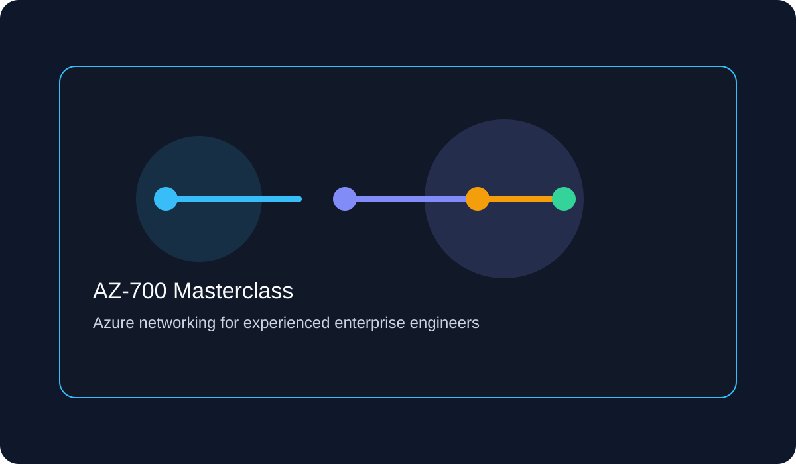

# AZ-700 Masterclass

Welcome to a professional Azure networking study portal built for experienced engineers who already understand routing, firewalls, VPNs, and enterprise network design.

## Hero section

This site translates Azure networking into the language of enterprise networking. Every lesson answers the same question: how is Azure different from what you already know?

## Study roadmap

- 30-day plan for disciplined preparation
- Domain-based lessons and exam-aligned checkpoints
- Hands-on labs, flashcards, and timed practice tests
- Printable cram guide and daily review checklist

## Progress dashboard

  

    <h3>Current focus</h3>
    
Core connectivity, routing, DNS, security, and monitoring.

  

  

    <h3>Estimated completion</h3>
    
4–6 weeks at 12 hours per week.

  

  

    <h3>Exam domains</h3>
    
Designing, implementing, maintaining, and troubleshooting Azure networking solutions.

  

## Recommended study order

1. VNets and subnets
2. Routing and Route Server
3. Azure Firewall, NSGs, and Private Link
4. ExpressRoute, Virtual WAN, and load balancing
5. Monitoring, security, troubleshooting, and automation

## Quick links

- [Study Plan](study-plan.md)
- [Exam Objectives](exam-objectives.md)
- [Exam Cram](exam-cram.md)
- [Flashcards](flashcards/index.md)
- [Practice Tests](practice-tests/index.md)

## Recent updates

- Added architecture-focused lessons for every major Azure networking service
- Added a full interactive flashcard deck and five timed practice tests
- Added hands-on labs and printable study reference material

## Study tips

- Translate every Azure concept into a familiar enterprise network concept
- Practice the packet flow for every service
- Memorize the default behavior before the exception path
- Review Azure CLI, PowerShell, and Bicep examples together

## Certification overview

The AZ-700 exam focuses on designing and implementing Azure networking solutions, including hybrid connectivity, routing, security, load balancing, monitoring, and governance.
